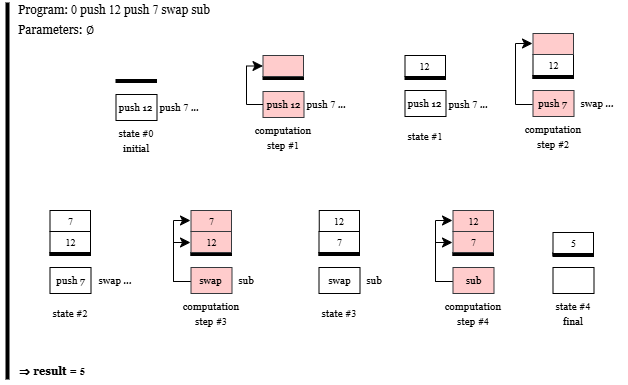

# Beaumont Léo et Chouki Mouad
## Exercice 1

**What is a stack? What are the operations that you usually execute on a stack?**

Une stack (ou pile) est une structure de données qui suit le principe **LIFO (Last In First Out)**, c’est-à-dire que le dernier élément ajouté est le premier à être retiré.

Les éléments ne peuvent être manipulés qu’au **sommet de la pile**. On ne peut pas accéder directement aux éléments situés plus profondément sans retirer ceux qui sont au-dessus.

Les opérations les plus courantes sur une pile sont :

- **push** : ajoute un élément au sommet de la pile ;
- **pop** : retire l’élément situé au sommet de la pile ;
- **peek** (ou **top**) : permet de lire l’élément au sommet sans le retirer ;
- **swap** : échange les deux éléments situés au sommet de la pile.

## Exercice 2

**Detail in the same way the execution of 0 push 12 push 7 swap sub.**

Le schéma suivant illustre les différentes étapes de l'exécution :



## Exercice 3

### 3.1 Explain using plain words the semantics of programs.

La sémantique d’un programme décrit comment un programme Pfx est exécuté à partir d’une liste de paramètres.

Un programme est défini par deux éléments :  
- un entier n qui représente le nombre d’arguments attendus par le programme,  
- une séquence d’instructions Q.

Les arguments v1, ..., vn sont empilés dans la pile avant l’exécution du programme.

Les règles données décrivent les différents résultats possibles de l’exécution :

1. Si le nombre d’arguments fournis est différent du nombre d’arguments attendus par le programme, alors l’exécution produit une erreur.

2. Si le nombre d’arguments est correct mais que l’exécution des instructions mène à une erreur pendant le calcul, alors le résultat du programme est également une erreur.

3. Si l’exécution des instructions se termine correctement, la pile contient une valeur v au sommet. Cette valeur est alors le résultat final du programme.


### 3.2 A case is still missing, spot it out and give the corresponding rule.

Un cas n’est pas couvert par les règles données : lorsque l’exécution du programme se termine sans erreur mais que la pile finale est vide. Dans cette situation, aucune valeur ne peut être retournée comme résultat du programme.

Ce cas doit donc produire une erreur.

La règle correspondante peut être écrite comme suit :

$$ \frac{Q, v_1 :: \dots :: v_n :: \emptyset \rightarrow^* \emptyset, \emptyset}{v_1, \dots, v_n \Vdash n, Q \Rightarrow ERR} $$

## Exercice 3

### 3.3 Give the rules describing the small step semantics for instruction sequences. Beware to cover all cases of runtime errors.

Les règles suivantes décrivent la sémantique opérationnelle en petits pas des instructions du langage Pfx.  
Chaque règle décrit comment une instruction transforme la pile et la séquence d’instructions restante.

**Push**

$$
push\ n . Q , S \rightarrow Q , n :: S
$$

**Pop**

$$
pop . Q , n :: S \rightarrow Q , S
$$

**Swap**

$$
swap . Q , n_1 :: n_2 :: S \rightarrow Q , n_2 :: n_1 :: S
$$

**Add**

$$
add . Q , n_1 :: n_2 :: S \rightarrow Q , (n_2 + n_1) :: S
$$

**Sub**

$$
sub . Q , n_1 :: n_2 :: S \rightarrow Q , (n_2 - n_1) :: S
$$

**Mul**

$$
mul . Q , n_1 :: n_2 :: S \rightarrow Q , (n_2 \times n_1) :: S
$$

**Div**

$$
\frac{n_1 \neq 0}{div . Q , n_1 :: n_2 :: S \rightarrow Q , (n_2 / n_1) :: S}
$$

**Rem**

$$
\frac{n_1 \neq 0}{rem . Q , n_1 :: n_2 :: S \rightarrow Q , (n_2 \bmod n_1) :: S}
$$

**Erreurs d'exécution**

Les erreurs d'exécution se produisent lorsque la pile ne contient pas suffisamment d'éléments pour exécuter l'instruction ou lorsque l'on tente une division par zéro.

**Pop sur pile vide**

$$
pop . Q , \emptyset \rightarrow Err
$$

**Swap avec moins de deux éléments**

$$
swap . Q , n :: \emptyset \rightarrow Err
$$

$$
swap . Q , \emptyset \rightarrow Err
$$

**Opérations arithmétiques avec moins de deux éléments**

$$
op . Q , \emptyset \rightarrow Err
$$

$$
op . Q , n :: \emptyset \rightarrow Err
$$

où $op \in \{add, sub, mul, div, rem\}$.

**Division ou reste par zéro**

$$
div . Q , 0 :: n :: S \rightarrow Err
$$

$$
rem . Q , 0 :: n :: S \rightarrow Err
$$
## Exercice 4
### 4.1 Propose the OCaml code for a type command describing the Pfx instructions. It should be in the file pfx/basic/ast.ml
```oCaml
type command =
  | Push of int
  | Pop
  | Swap
  | Add
  | Sub
  | Mul
  | Div
  | Rem
```
Le type commande défini chaque instruction possible. Il y a un cas particulier pour l'instruction `push` qui prend un `int` en argument, on ajoute donc `of int` pour le préciser. On vient également compléter la déclaration de type dans le fichier `pfx/basic/ast.mli`. On vient également compléter la fonction `string_of_command` qui associe à chaque instruction sa notation en texte. Pour cela on utilise le pattern matching. Le seul cas particulier est le `push` pour lequel on doit transformer son argument en `string` en utilisant `string_of_int` et la concaténation de `string`.
### 4.2 Write an OCaml function step that implements the small step reduction you defined above on Pfx instructions. It should be in the file pfx/basic/eval.ml
```oCaml
let step state =
  match state with
  | [], _ -> Error("Nothing to step",state)
  (* Division by 0 *)
  | Div :: q, v1 :: 0 :: stack -> Error("Division by 0", state)
  | Rem :: q, v1 :: 0 :: stack -> Error("Division by 0", state)
  (* Valid configurations *)
  | Push n :: q , stack          -> Ok (q, n :: stack)
  | Pop :: q, v :: stack         -> Ok (q, stack)
  | Swap :: q, v1 :: v2 :: stack -> Ok (q, v2 :: v1 :: stack)
  | Add :: q, v1 :: v2 :: stack  -> Ok (q, (v1 + v2) :: stack)
  | Sub :: q, v1 :: v2 :: stack  -> Ok (q, (v1 - v2) :: stack)
  | Mul :: q, v1 :: v2 :: stack  -> Ok (q, (v1 * v2) :: stack)
  | Div :: q, v1 :: v2 :: stack  -> Ok (q, (v1 / v2) :: stack)
  | Rem :: q, v1 :: v2 :: stack  -> Ok (q, (v1 mod v2) :: stack)
  (* Not enough elements in stack *)
  | command :: q, stack -> Error("Stack underflow", state)
  ```
  Pour l'implémentation de la fonction `step` nous utilisons le pattern matching. Une propriété intéressante du pattern matching en oCaml est que l'ordre d'apparation de chaque `case` dans le code détermine l'ordre dans lequel le matching est effectué. Nous pouvons donc utiliser cela pour dans un premier temps tester les cas d'erreurs comme la division par 0 ou l'absence d'instruction. Après s'être assuré que la commande ne mène pas à une erreur, nous poursuivons avec les cas valides des instructions (`push`, `pop`, `swap`, `add`, `sub`, `mul`, `div` et `rem`), qui effectuent chacune l'opération qui leur est associée sur la pile. Si auncune erreur et aucun pattern valide n'est matché alors il ne reste plus que le cas où il n'y a pas assez d'éléments dans la pile pour réaliser l'instruction, on renvoit donc une erreur sans se préoccuper de l'instruction. 
