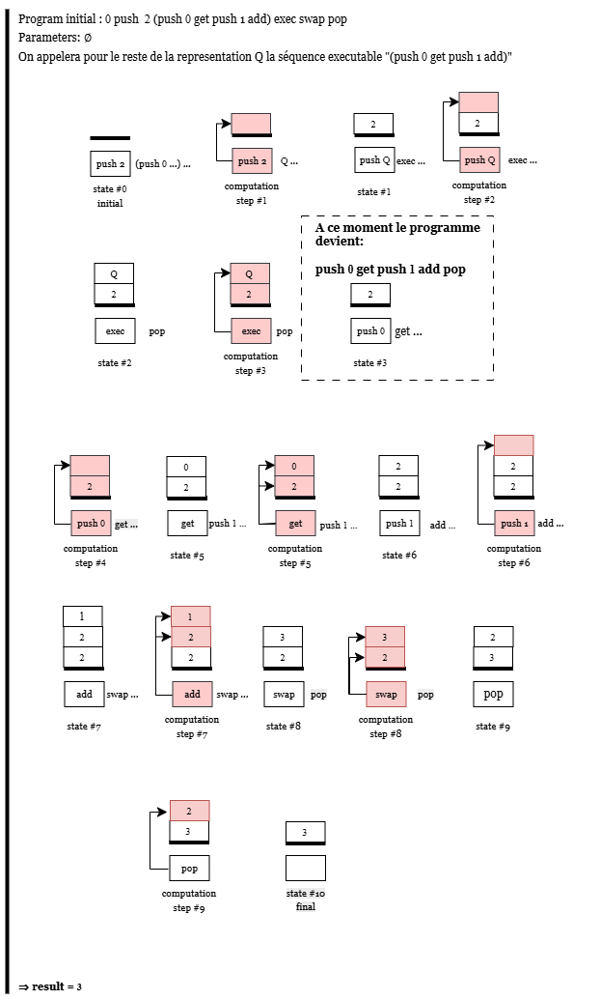
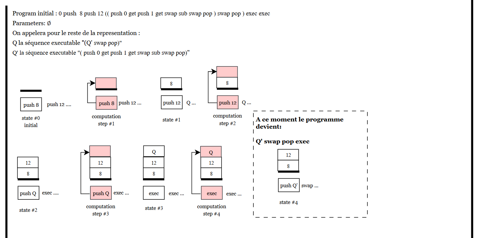
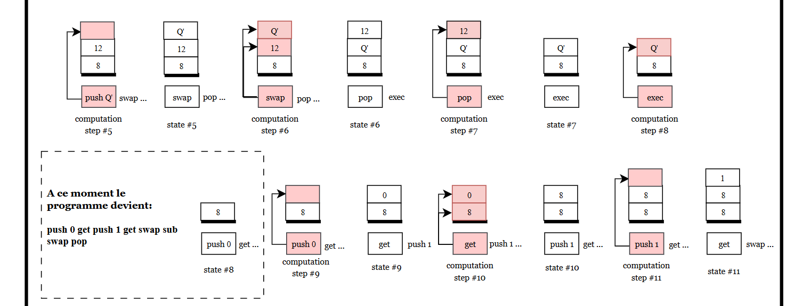
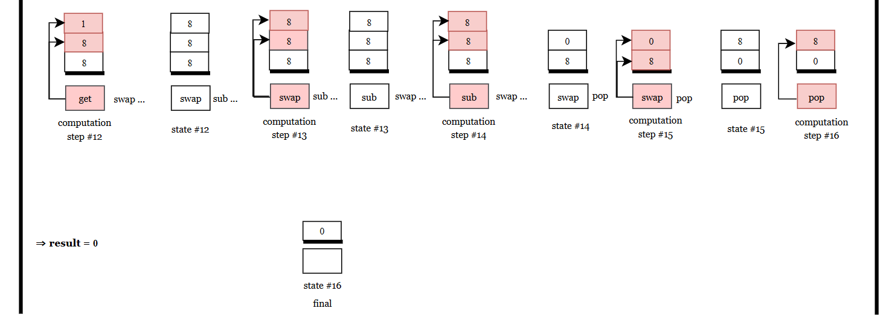

# Beaumont Léo et Chouki Mouad
## Exercice 1

**What is a stack? What are the operations that you usually execute on a stack?**

Une stack (ou pile) est une structure de données qui suit le principe **LIFO (Last In First Out)**, c’est-à-dire que le dernier élément ajouté est le premier à être retiré.

Les éléments ne peuvent être manipulés qu’au **sommet de la pile**. On ne peut pas accéder directement aux éléments situés plus profondément sans retirer ceux qui sont au-dessus.

Les opérations les plus courantes sur une pile sont :

- **push** : ajoute un élément au sommet de la pile ;
- **pop** : retire l’élément situé au sommet de la pile ;
- **peek** (ou **top**) : permet de lire l’élément au sommet sans le retirer ;
- **swap** : échange les deux éléments situés au sommet de la pile.

## Exercice 2

**Detail in the same way the execution of 0 push 12 push 7 swap sub.**

Le schéma suivant illustre les différentes étapes de l'exécution :


## Exercice 3

### 3.1 Explain using plain words the semantics of programs.

La sémantique d’un programme décrit comment un programme Pfx est exécuté à partir d’une liste de paramètres.

Un programme est défini par deux éléments :  
- un entier n qui représente le nombre d’arguments attendus par le programme,  
- une séquence d’instructions Q.

Les arguments v1, ..., vn sont empilés dans la pile avant l’exécution du programme.

Les règles données décrivent les différents résultats possibles de l’exécution :

1. Si le nombre d’arguments fournis est différent du nombre d’arguments attendus par le programme, alors l’exécution produit une erreur.

2. Si le nombre d’arguments est correct mais que l’exécution des instructions mène à une erreur pendant le calcul, alors le résultat du programme est également une erreur.

3. Si l’exécution des instructions se termine correctement, la pile contient une valeur v au sommet. Cette valeur est alors le résultat final du programme.


### 3.2 A case is still missing, spot it out and give the corresponding rule.

Un cas n’est pas couvert par les règles données : lorsque l’exécution du programme se termine sans erreur mais que la pile finale est vide. Dans cette situation, aucune valeur ne peut être retournée comme résultat du programme.

Ce cas doit donc produire une erreur.

La règle correspondante peut être écrite comme suit :

$$ \frac{Q, v_1 :: \dots :: v_n :: \emptyset \rightarrow^* \emptyset, \emptyset}{v_1, \dots, v_n \Vdash n, Q \Rightarrow ERR} $$


### 3.3 Give the rules describing the small step semantics for instruction sequences. Beware to cover all cases of runtime errors.

Les règles suivantes décrivent la sémantique opérationnelle en petits pas des instructions du langage Pfx.  
Chaque règle décrit comment une instruction transforme la pile et la séquence d’instructions restante.

**Push**

$$
push\ n . Q , S \rightarrow Q , n :: S
$$

**Pop**

$$
pop . Q , n :: S \rightarrow Q , S
$$

**Swap**

$$
swap . Q , n_1 :: n_2 :: S \rightarrow Q , n_2 :: n_1 :: S
$$

**Add**

$$
add . Q , n_1 :: n_2 :: S \rightarrow Q , (n_2 + n_1) :: S
$$

**Sub**

$$
sub . Q , n_1 :: n_2 :: S \rightarrow Q , (n_1 - n_2 ) :: S
$$

**Mul**

$$
mul . Q , n_1 :: n_2 :: S \rightarrow Q , (n_2 \times n_1) :: S
$$

**Div**

$$
\frac{n_1 \neq 0}{div . Q , n_1 :: n_2 :: S \rightarrow Q , (n_1 / n_2) :: S}
$$

**Rem**

$$
\frac{n_1 \neq 0}{rem . Q , n_1 :: n_2 :: S \rightarrow Q , (n_1 \bmod n_2) :: S}
$$

**Erreurs d'exécution**

Les erreurs d'exécution se produisent lorsque la pile ne contient pas suffisamment d'éléments pour exécuter l'instruction ou lorsque l'on tente une division par zéro.

**Pop sur pile vide**

$$
pop . Q , \emptyset \rightarrow Err
$$

**Swap avec moins de deux éléments**

$$
swap . Q , n :: \emptyset \rightarrow Err
$$

$$
swap . Q , \emptyset \rightarrow Err
$$

**Opérations arithmétiques avec moins de deux éléments**

$$
op . Q , \emptyset \rightarrow Err
$$

$$
op . Q , n :: \emptyset \rightarrow Err
$$

où $op \in \{add, sub, mul, div, rem\}$.

**Division ou reste par zéro**

$$
div . Q , 0 :: n :: S \rightarrow Err
$$

$$
rem . Q , 0 :: n :: S \rightarrow Err
$$
## Exercice 4
### 4.1 Propose the OCaml code for a type command describing the Pfx instructions. It should be in the file pfx/basic/ast.ml
```oCaml
type command =
  | Push of int
  | Pop
  | Swap
  | Add
  | Sub
  | Mul
  | Div
  | Rem
```
Le type commande défini chaque instruction possible. Il y a un cas particulier pour l'instruction `push` qui prend un `int` en argument, on ajoute donc `of int` pour le préciser. On vient également compléter la déclaration de type dans le fichier `pfx/basic/ast.mli`. On vient également compléter la fonction `string_of_command` qui associe à chaque instruction sa notation en texte. Pour cela on utilise le pattern matching. Le seul cas particulier est le `push` pour lequel on doit transformer son argument en `string` en utilisant `string_of_int` et la concaténation de `string`.
### 4.2 Write an OCaml function step that implements the small step reduction you defined above on Pfx instructions. It should be in the file pfx/basic/eval.ml
```oCaml
let step state =
  match state with
  | [], _ -> Error("Nothing to step",state)
  (* Division by 0 *)
  | Div :: q, v1 :: 0 :: stack -> Error("Division by 0", state)
  | Rem :: q, v1 :: 0 :: stack -> Error("Division by 0", state)
  (* Valid configurations *)
  | Push n :: q , stack          -> Ok (q, n :: stack)
  | Pop :: q, v :: stack         -> Ok (q, stack)
  | Swap :: q, v1 :: v2 :: stack -> Ok (q, v2 :: v1 :: stack)
  | Add :: q, v1 :: v2 :: stack  -> Ok (q, (v1 + v2) :: stack)
  | Sub :: q, v1 :: v2 :: stack  -> Ok (q, (v1 - v2) :: stack)
  | Mul :: q, v1 :: v2 :: stack  -> Ok (q, (v1 * v2) :: stack)
  | Div :: q, v1 :: v2 :: stack  -> Ok (q, (v1 / v2) :: stack)
  | Rem :: q, v1 :: v2 :: stack  -> Ok (q, (v1 mod v2) :: stack)
  (* Not enough elements in stack *)
  | command :: q, stack -> Error("Stack underflow", state)
  ```
Pour l'implémentation de la fonction `step` nous utilisons le pattern matching. Une propriété intéressante du pattern matching en oCaml est que l'ordre d'apparation de chaque `case` dans le code détermine l'ordre dans lequel le matching est effectué. Nous pouvons donc utiliser cela pour dans un premier temps tester les cas d'erreurs comme la division par 0 ou l'absence d'instruction. Après s'être assuré que la commande ne mène pas à une erreur, nous poursuivons avec les cas valides des instructions (`push`, `pop`, `swap`, `add`, `sub`, `mul`, `div` et `rem`), qui effectuent chacune l'opération qui leur est associée sur la pile. Si auncune erreur et aucun pattern valide n'est matché alors il ne reste plus que le cas où il n'y a pas assez d'éléments dans la pile pour réaliser l'instruction, on renvoit donc une erreur sans se préoccuper de l'instruction.
## Exercice 5
### 5.1 Propose a compilation schema of Expr in Pfx. Give its formal description. Notice that with the current definition of Pfx, we cannot implement variables.
La compilation d’une expression du langage `Expr` vers le langage `Pfx` consiste à transformer l’arbre syntaxique de l’expression en une séquence d’instructions pour la machine à pile Pfx.  
L’objectif est que l’exécution de cette séquence d’instructions laisse la valeur de l’expression au sommet de la pile.

On note cette traduction :
$$
\llbracket e \rrbracket
$$
qui représente la séquence d’instructions Pfx générée à partir de l’expression $e$.

Les règles de compilation sont les suivantes.

**Constante**

$$
\llbracket Const(n) \rrbracket = push\ n
$$

**Addition**

$$
\llbracket Binop(Badd, e_1, e_2) \rrbracket =
\llbracket e_2 \rrbracket \;
\llbracket e_1 \rrbracket \;
add
$$

**Soustraction**

$$
\llbracket Binop(Bsub, e_1, e_2) \rrbracket =
\llbracket e_2 \rrbracket \;
\llbracket e_1 \rrbracket \;
sub
$$

**Multiplication**

$$
\llbracket Binop(Bmul, e_1, e_2) \rrbracket =
\llbracket e_2 \rrbracket \;
\llbracket e_1 \rrbracket \;
mul
$$

**Division**

$$
\llbracket Binop(Bdiv, e_1, e_2) \rrbracket =
\llbracket e_2 \rrbracket \;
\llbracket e_1 \rrbracket \;
div
$$

**Modulo**

$$
\llbracket Binop(Bmod, e_1, e_2) \rrbracket =
\llbracket e_2 \rrbracket \;
\llbracket e_1 \rrbracket \;
rem
$$

**Moins unaire**

$$
\llbracket Uminus(e) \rrbracket =
\llbracket e \rrbracket \;
push\ (-1) \;
mul
$$

Les variables ne peuvent pas être compilées dans cette version du langage Pfx, car la machine à pile ne possède pas de mécanisme pour stocker ou accéder à des variables. Leur implémentation est donc reportée à un exercice ultérieur.
### 5.2 Define a function generate implementing the semantics you defined in previous question. It should be in the file expr/basic/toPfx.ml
```oCaml
let rec generate = function
  | Const n ->
      [Push n]

  | Binop (op, e1, e2) ->
      let c1 = generate e1 in
      let c2 = generate e2 in
      let op_cmd =
        match op with
        | Badd -> Add
        | Bsub -> Sub
        | Bmul -> Mul
        | Bdiv -> Div
        | Bmod -> Rem
      in
      c2 @ c1 @ [op_cmd]

  | Uminus e ->
      generate e @ [Push (-1); Mul]

  | Var _ ->
      failwith "Not yet supported"
```
La fonction `generate` traite les différents cas du langage `Expr` en suivant la logique définie dans la question `5.1`.

On commence par traiter le cas `Const n` qui correspond simplement à pousser `n` sur la pile.

Dans le cas d'une opération binaire (`Binop`), elle se décompose en trois éléments: l'opération `op` et les deux expressions `e1` et `e2` sur lesquelles l'opération est appliquée. Dans ce cas on appelle récursivement `generate` sur les expressions `e1` et `e2` pour terminer leur traitement. Ensuite on concatène le traitement de `e2`, puis le traitement de `e1` et enfin l'opération `op`. L'ordre est important car nous voulons que `e1` se trouve au sommet de la pile avec `e2` juste en dessous, suivi de l'opération `op` pour que les opérations non commutatives comme la soustractions fassent bien `e1 - e2` et non `e2 - e1`.

Pour `Uminus` qui permet d'obtenir l'opposé d'une expression `e`, on appelle récursivement `generate` pour finir le traitement de `e`. On concatène le traitement de `e` avec l'instruction `push -1` et l'opération `mul`. Concrètement cela permet de multiplier l'expression `e` par -1 et donc d'obtenir son opposé.

Vous trouverez [ici](https://github.com/leobeaumont/compilateur_lalog/tree/version1/basic) un lien vers la branche où figure une version du code avec uniquement les implémentations des exercices 4 et 5.

## Exercice 6

### 6.1 Write a lexer for the Pfx stack machine language. Complete the provided lexer.mll of pfx/basic.

```ocaml
rule token = parse
  | newline+         { token lexbuf }
  | blank+           { token lexbuf }
  | eof              { EOF }

  | number as nb     { mk_int nb }

  | "add"            { ADD }
  | "sub"            { SUB }
  | "mul"            { MUL }
  | "div"            { DIV }
  | "rem"            { REM }
  | "pop"            { POP }
  | "swap"           { SWAP }

  | _ as c           { failwith (Printf.sprintf "Illegal character '%c': " c) }
```

Le fichier `lexer.mll` définit un analyseur lexical pour le langage `Pfx` en utilisant l’outil `ocamllex`. Le rôle du lexer est de transformer une suite de caractères lue dans un fichier `.pfx` en une suite de tokens qui seront ensuite utilisés par le parser.

Les premières règles permettent d’ignorer certains caractères qui ne sont pas significatifs pour l’analyse syntaxique. Les règles `newline+` et `blank+` correspondent respectivement aux retours à la ligne et aux espaces. Dans ces cas, le lexer appelle récursivement la fonction `token` afin de continuer l’analyse sans produire de token.

La règle `eof` correspond à la fin du fichier et produit le token `EOF`.

La règle `number as nb` permet de reconnaître une suite de chiffres représentant un entier. La chaîne correspondante est convertie en entier grâce à la fonction `mk_int`, qui produit un token `INT`.

Les règles suivantes reconnaissent les différentes instructions du langage `Pfx`. Chaque mot clé du langage est associé à un token correspondant : `add`, `sub`, `mul`, `div`, `rem`, `pop` et `swap`.

Enfin, la dernière règle capture tout caractère qui ne correspond à aucune règle précédente. Dans ce cas, une exception est levée indiquant qu’un caractère illégal a été rencontré dans le fichier source.

---

### 6.2 Reuse this code to be able to parse a file containing a Pfx program and prints all the tokens encountered in the process.

```ocaml
let rec examine_all lexbuf =
  let result = token lexbuf in
  print_token result;
  print_string " ";
  match result with
  | EOF -> ()
  | _   -> examine_all lexbuf
```

La fonction `examine_all` permet de tester le fonctionnement du lexer en affichant tous les tokens reconnus dans un fichier `.pfx`.

Elle prend en argument un `lexbuf`, qui est une structure utilisée par le lexer pour lire le flux de caractères provenant du fichier d’entrée.

À chaque appel, la fonction appelle `token lexbuf` afin d’obtenir le prochain token reconnu par le lexer. Ce token est ensuite affiché grâce à la fonction `print_token`. Après l’affichage, un espace est ajouté afin de rendre la sortie plus lisible.

La fonction examine ensuite le token obtenu. Si le token est `EOF`, cela signifie que la fin du fichier a été atteinte et la fonction s’arrête. Sinon, elle s’appelle récursivement afin d’analyser le reste du fichier.

Cette fonction permet donc de parcourir entièrement un fichier source et d’afficher tous les tokens générés par le lexer. Elle constitue un moyen simple de vérifier que l’analyse lexicale du langage `Pfx` fonctionne correctement avant de connecter le lexer au parser.

Vous trouverez [ici](https://github.com/leobeaumont/compilateur_lalog/tree/version2/parsing) le lien vers la branche où figure le code avec l'implémation jusqu'à l'exercice 6 compris.

## Exercice 7

### Modify your code from the previous exercise to be able to return the location of errors.

Pour améliorer les messages d’erreur du compilateur, il est nécessaire d’indiquer la position exacte de l’erreur dans le fichier source.  
OCaml fournit pour cela le module `Lexing`, qui contient un type `position` permettant de représenter la position courante dans le fichier analysé.

Une position contient plusieurs informations :

- `pos_fname` : le nom du fichier
- `pos_lnum` : le numéro de la ligne
- `pos_bol` : la position du début de la ligne
- `pos_cnum` : le nombre de caractères depuis le début du fichier

Dans cet exercice, on utilise le module `Location` fourni dans le projet.  
Ce module fournit plusieurs éléments utiles pour gérer les positions dans les messages d’erreur.

Les principaux éléments utilisés sont :

- l’exception `Location.Error`, qui contient un message d’erreur et la localisation de cette erreur ;
- le type `Location.t`, qui représente une zone du fichier (position de début et de fin) ;
- la fonction `Location.init`, qui initialise le nom du fichier associé au buffer lexical ;
- la fonction `Location.incr_line`, qui met à jour le numéro de ligne lorsqu’un retour à la ligne est rencontré ;
- la fonction `Location.curr`, qui retourne la position courante dans le buffer.

Pour intégrer la gestion des positions dans le lexer, on modifie certaines règles afin de mettre à jour les informations de localisation.

```ocaml
rule token = parse
  | newline+        { Location.incr_line lexbuf; token lexbuf }
  | blank+          { token lexbuf }
  | eof             { EOF }

  | number as nb    { mk_int nb }

  | "add"           { ADD }
  | "sub"           { SUB }
  | "mul"           { MUL }
  | "div"           { DIV }
  | "rem"           { REM }
  | "pop"           { POP }
  | "swap"          { SWAP }

  | _ as c ->
      let loc = Location.curr lexbuf in
      raise (Location.Error (loc, Printf.sprintf "Illegal character '%c'" c))
```

Dans cette version du lexer, lorsqu’un caractère invalide est rencontré, on récupère la position courante dans le fichier grâce à la fonction `Location.curr`.  
Cette position est ensuite utilisée pour lever une exception `Location.Error` contenant à la fois le message d’erreur et la localisation précise de l’erreur.

Ainsi, lorsqu’une erreur lexicale est détectée, le compilateur peut afficher un message indiquant non seulement le problème rencontré mais aussi la ligne et la position exacte dans le fichier source.  
Cela permet à l’utilisateur d’identifier et de corriger plus facilement l’erreur dans son programme.

Pour que ces informations de localisation soient correctement initialisées, il est également nécessaire de modifier la fonction `compile` afin d’associer le nom du fichier analysé au buffer lexical.

```ocaml
let compile file =
  print_string ("File "^file^" is being treated!\n");
  try
    let input_file = open_in file in
    let lexbuf = Lexing.from_channel input_file in
    Location.init lexbuf file;
    examine_all lexbuf;
    print_newline ();
    close_in input_file
  with Sys_error _ ->
    print_endline ("Can't find file '" ^ file ^ "'")

let _ = Arg.parse [] compile ""
```

L’appel à `Location.init` initialise les informations de localisation du buffer lexical, notamment le nom du fichier courant.  
Grâce à cela, lorsqu’une erreur lexicale est levée, le compilateur est capable d’afficher un message d’erreur précis indiquant la ligne et la position de l’erreur dans le fichier source.

Vous trouverez [ici](https://github.com/leobeaumont/compilateur_lalog/tree/version3/locating_errors) une version du code avec l'implémentation jusqu'à l'exercice 7 compris.

## Exercice 8 

### 8.1 Write a parser for the Pfx stack machine language.

Le parser est défini dans le fichier `parser.mly` à l’aide de l’outil **Menhir**.  
Son rôle est de transformer la suite de tokens produite par le lexer en une structure de données représentant le programme Pfx.

Un programme Pfx est représenté par un couple :

```
(int * command list)
```

où :

- le premier entier correspond au nombre d’arguments attendus par le programme,
- la liste contient les instructions de la machine à pile.

La règle principale du parser est la suivante :

```ocaml
program:
  INT commands EOF
    { ($1, $2) }
```

Cette règle indique qu’un programme commence par un entier indiquant le nombre d’arguments, suivi d’une suite de commandes, puis de la fin du fichier.

La liste des commandes est définie récursivement :

```ocaml
commands:
  | command commands { $1 :: $2 }
  | { [] }
```

Cette définition permet de construire progressivement la liste des instructions du programme.

Chaque instruction du langage est ensuite transformée en une commande de l’AST :

```ocaml
command:
  | INT   { Push $1 }
  | ADD   { Add }
  | SUB   { Sub }
  | MUL   { Mul }
  | DIV   { Div }
  | REM   { Rem }
  | POP   { Pop }
  | SWAP  { Swap }
```

Chaque token reconnu par le lexer correspond ainsi à une instruction de la machine Pfx.

Le parser construit donc progressivement la représentation interne du programme sous forme d’un AST.

### 8.2 Test it in combination with your Lexer.


Une fois le parser implémenté, il peut être testé en combinaison avec le lexer et la machine virtuelle Pfx.

Le programme principal `pfxVM.ml` lit un fichier `.pfx`, appelle le lexer puis le parser afin de construire l’AST du programme.  
Cet AST est ensuite exécuté par la machine virtuelle grâce à la fonction `Eval.eval_program`.

Le pipeline complet devient donc :

```
fichier .pfx
    ↓
lexer
    ↓
parser
    ↓
AST Pfx
    ↓
machine virtuelle
```

Par exemple, pour un fichier contenant :

```
0 5 18 add
```

le parser produit l’AST suivant :

```
(0, [Push 5; Push 18; Add])
```

La machine virtuelle exécute ensuite ce programme et renvoie le résultat :

```
23
```

Cette étape permet de vérifier que le lexer et le parser fonctionnent correctement ensemble avant de poursuivre les étapes suivantes du compilateur.

Pour se faire, nous avons ajouté une fonction permettant d’afficher l’AST du programme Pfx. Cette fonction est définie dans `ast.ml` :

```ocaml
let string_of_program (args, cmds) =
  Printf.sprintf "%i args: %s\n" args (string_of_commands cmds)
```

Elle convertit un programme Pfx représenté par `(int * command list)` en chaîne de caractères afin de visualiser facilement l’AST produit par le parser.

Dans le fichier `pfx/pfxVM.ml`, nous affichons ensuite cet AST après l’analyse du programme :

```ocaml
let pfx_prog = Parser.program Lexer.token lexbuf in
print_string (Ast.string_of_program pfx_prog);
Eval.eval_program pfx_prog !args
```

Cette modification permet de vérifier que le parser construit correctement la structure interne du programme avant son exécution par la machine virtuelle.

Il a également été nécessaire de modifier légèrement le fichier `lexer.mll`. Les fonctions utilisées pour tester le lexer indépendamment (`examine_all`, `compile` et `Arg.parse`) ont été supprimées, car le lexer est maintenant utilisé directement par le parser.

Enfin, le lexer utilise désormais les tokens définis dans le parser en important le module correspondant :

```ocaml
{
open Parser
open Utils
open Location
}
```

Vous trouverez [ici](https://github.com/leobeaumont/compilateur_lalog/tree/version4/exercice8/Pfx_parser) une version du code avec l'implémentation jusqu'à l'exercice 8 compris.

## Exercice 9 


### 9.1 Do we need to change the rules for the already defined constructs?

Non, il n’est pas nécessaire de modifier les règles des constructions déjà définies.

Les instructions existantes du langage Pfx (`push`, `pop`, `swap`, `add`, `sub`, `mul`, `div`, `rem`) manipulent uniquement la pile en effectuant des opérations arithmétiques ou des réorganisations des éléments présents sur la pile. Leur comportement reste donc correct même si la pile peut désormais contenir deux types d’objets : des entiers et des séquences exécutables.

Les nouvelles constructions introduites (`Q` pour une séquence exécutable, `exec`, et `get`) ajoutent simplement de nouvelles possibilités d’interaction avec la pile, mais elles ne modifient pas la sémantique des instructions existantes.

Ainsi, les règles déjà définies pour les anciennes instructions restent valides et peuvent être conservées telles quelles. Il suffit simplement d’ajouter de nouvelles règles pour décrire le comportement des nouvelles instructions.

### 9.2 Give the formal semantics of these new constructions.

Nous introduisons trois nouvelles constructions dans le langage Pfx : les séquences exécutables `(Q)`, l'instruction `exec` et l'instruction `get`. Ces constructions permettent de manipuler du code comme des données sur la pile.

La pile peut désormais contenir deux types d'éléments : des entiers ou des séquences exécutables.

---

**Executable sequence**

Lorsqu'une séquence d'instructions `(Q')` est rencontrée, elle est poussée sur la pile comme une valeur.

$$
(Q') , S \rightarrow Q' :: S
$$

Autrement dit, la séquence `Q` n'est pas exécutée immédiatement mais stockée sur la pile.

---

**Exec**

L'instruction `exec` dépile une séquence exécutable et l'ajoute au début de la séquence d'instructions en cours d'exécution.

$$
exec . Q , Q' :: S \rightarrow Q' . Q , S
$$

Cela signifie que la séquence `Q'` est exécutée avant la suite du programme.

---

**Get**

L'instruction `get` permet d'accéder à un élément déjà présent dans la pile. Elle dépile un entier `i` et copie sur le sommet de la pile le `i`-ième élément de la pile.

$$
get . Q , i :: v_1 :: \dots :: v_n :: S \rightarrow Q , v_i :: v_1 :: \dots :: v_n :: S
$$

Cette opération échoue si l'indice demandé ne correspond pas à un élément présent dans la pile.

$$
\frac{i > n}
{get . Q , i :: v_1 :: \dots :: v_n :: S \rightarrow Err}
$$

---

Ces nouvelles règles permettent d'implémenter des comportements proches des fonctions en manipulant des séquences exécutables directement sur la pile.

### 9.3 Extend the lexer and parser of Pfx to include these changes

Afin de pouvoir compiler les fonctions du langage `Expr`, le langage **Pfx** doit être étendu avec trois nouvelles constructions :

- une **séquence exécutable `(Q)`**
- l'instruction **`exec`**
- l'instruction **`get`**

Ces nouvelles instructions permettent de manipuler du code comme une donnée dans la pile et d'accéder aux arguments lors de l'exécution d'une fonction.

---

**Modification du type `command` dans `pfx/basic/ast.ml`** 


```ocaml
type command =
  | Push of int
  | Pop
  | Swap
  | Add
  | Sub
  | Mul
  | Div
  | Rem
  | Exec
  | Get
  | Seq of command list
```

Le type `command` est étendu afin de représenter les nouvelles constructions du langage :

`Exec` correspond à l’instruction `exec`, qui permet d’exécuter une séquence de commandes présente au sommet de la pile.

`Get` correspond à l’instruction `get`, qui permet d’accéder à un élément de la pile selon son indice.

`Seq of command list` représente une **séquence exécutable** (Q), c’est-à-dire une liste de commandes pouvant être stockée dans la pile puis exécutée ultérieurement.

Ainsi, la pile peut désormais contenir deux types de valeurs : des entiers et des séquences de commandes.

Cette extension est nécessaire pour implémenter le mécanisme d’appel de fonctions.

**Extensions du parser `pfx/basic/parser.mly`**

Ajout de nouveaux tokens :

```ocaml
%token EXEC GET LPAR RPAR
```

Ajout de nouvelles règles dans la grammaire :

```ocaml
command:
  | n=INT { Push n }
  | ADD { Add }
  | SUB { Sub }
  | MUL { Mul }
  | DIV { Div }
  | REM { Rem }
  | POP { Pop }
  | SWAP { Swap }
  | EXEC { Exec }
  | GET { Get }
  | LPAR cmds=commands RPAR { Seq cmds }
```

Le parser doit être capable de reconnaître les nouvelles constructions du langage Pfx :

-**EXEC** et **GET** sont ajoutés comme nouvelles instructions de la machine.

-**LPAR** et **RPAR** permettent d’identifier une séquence exécutable `(Q)`.

Lorsque le parser reconnaît une séquence `(Q)`, celle-ci est transformée en valeur OCaml `Seq cmds` où cmds représente la liste des commandes contenues dans la séquence.

Par exemple, l'expression : `(0 get 1 add)` est transformée en `Seq [Push 0; Get; Push 1; Add]`

**Extensions du Lexer `pfx/basic/lexer.mll`**

Ajout des règles suivantes :

```Ocaml
| "exec" { EXEC }
| "get"  { GET }
| "("    { LPAR }
| ")"    { RPAR }
```
Le lexer doit reconnaître les nouveaux mots-clés introduits dans le langage ainsi que les paranthèses qui permettent de définir des séquences exécutables. Ces éléments sont convertis en tokens qui seront ensuite utilisés par le parseur pour construire l'AST.

**Extension de l'évaluation `pfx/basic/eval.ml`**

Ajout de nouveaux cas dans la fonction `step`:

```Ocaml
| Seq cmds :: q, stack ->
    Ok (q, VSeq cmds :: stack)

| Exec :: q, VSeq cmds :: stack ->
    Ok (cmds @ q, stack)

| Get :: q, i :: stack ->
    let v = List.nth stack i in
    Ok (q, v :: stack)
```
Ces règles définissent la sémantique opérationnelle des nouvelles instructions :

1. `Seq` place une séquence de commandes sur la pile comme une valeur.

2. `exec` retire cette séquence de la pile et l’insère au début de la liste des commandes à exécuter.

3. `get` récupère l’élément situé à la position `i` dans la pile et le copie au sommet.

Ce mécanisme permet d’implémenter l’appel de fonctions en manipulant du code comme des données dans la pile.

**Exemple de programme Pfx :  1 (0 get 1 add) exec**

Exécution avec ` dune exec ./pfx/pfxVM.exe -- -a 10 file.pfx`
Résulat : ` = 11 `

**Explication**

1. La pile contient initialement l’argument 10.

2. La séquence (0 get 1 add) est poussée sur la pile.

3. L’instruction exec exécute cette séquence.

4. 0 get récupère l’argument 10.

5. 1 add calcule 10 + 1.

Le résultat final est donc 11.


Grâce à ces modifications, la machine **Pfx** peut maintenant manipuler des séquences exécutables et accéder aux arguments dans la pile.

Vous trouverez [ici](https://github.com/leobeaumont/compilateur_lalog/tree/version5/exercice9/functions) une version du code avec implémentation jusqu'à l'exercice 9 compris.

## Exercice 10

### 10.1 Give the compiled version of the expression $(\lambda x. x + 1)\ 2$. Then describe step by step the evaluation of its Pfx translation.

Dans cette nouvelle version du compilateur, les fonctions sont traduites en **executable sequences** et les applications utilisent l’instruction `exec` pour exécuter ces séquences.

- Une abstraction de fonction $\lambda x.e$ est traduite en une **executable sequence** `( Q )` contenant la compilation de son corps.
- Une application `e1 e2` est traduite en :
  1. le code de l’argument,
  2. le code de la fonction,
  3. l’instruction `exec` pour exécuter la fonction,
  4. puis un `pop` pour retirer l’argument de la pile.

---

### Compilation de l'expression

L’expression :

$$(\lambda x. x + 1)\ 2$$

se compile de la manière suivante.

L’argument : $2$ devient `push 2`

Le corps de la fonction est $$ x+1 $$ Il faut accéder à l'argument `x`. Dans la pile, l'argument se trouve au sommet, on peut donc l'obtenir avec `push 0 get `. 

Le calcul complet devient donc : ` push 0 get push 1 add `.

La fonction complète est donc traduite en **executable sequence** : `( push 0 get push 1 add )`.

**Programme Pfx obtenu :**

`0 push 2 (push 0 get push 1 add ) exec swap pop `

**Evaluation pas à pas**





Ce résultat correspond bien à l’évaluation de l’expression :

$$
(\lambda x. x + 1)\ 2 = 3
$$

### 10.2 Give the formal rule for transformation.

Dans cette nouvelle version du compilateur, la traduction de **Expr vers Pfx** doit prendre en compte les fonctions et leur application.  
Pour cela, on introduit un environnement $\mathcal{P}$ qui associe chaque variable à sa **profondeur dans la pile**.

La traduction a la forme :

$$
\mathcal{P} \vdash e \Rightarrow Q
$$

où :

- $e$ est une expression du langage **Expr**,
- $\mathcal{P}$ est un environnement associant les variables à leur position dans la pile,
- $Q$ est la séquence d’instructions **Pfx** produite.

---

### Règle pour une variable

Si une variable $x$ est associée à une profondeur $i$ dans l’environnement $\mathcal{P}$, alors sa valeur est récupérée dans la pile avec l’instruction `get`.

$$
\frac{\mathcal{P}(x) = i}
{\mathcal{P} \vdash x \Rightarrow push\ i \; get}
$$

---

### Règle pour une abstraction de fonction

Une abstraction $\lambda x.e$ est traduite en une **executable sequence** contenant la compilation du corps de la fonction.

Lorsque l’on compile le corps, le paramètre $x$ se trouve au sommet de la pile, donc sa profondeur est $0$.

$$
\frac{\mathcal{P}[x \mapsto 0] \vdash e \Rightarrow Q}
{\mathcal{P} \vdash \lambda x.e \Rightarrow (Q)}
$$

---

### Règle pour l’application

Pour une application $e_1\ e_2$ :

1. on calcule d’abord l’argument,
2. puis la fonction,
3. on exécute la fonction avec `exec`,
4. et on retire l’argument de la pile avec `pop`.

$$
\frac{
\mathcal{P} \vdash e_2 \Rightarrow Q_2
\qquad
\mathcal{P} \vdash e_1 \Rightarrow Q_1
}
{
\mathcal{P} \vdash e_1\ e_2 \Rightarrow Q_2\ Q_1\ exec\ pop
}
$$

---

Ces règles décrivent formellement comment les **abstractions de fonctions** et les **applications** sont traduites du langage **Expr** vers le langage **Pfx**, en utilisant la pile pour représenter l’environnement des variables. 

### 10.3 Provide a new version of `generate`.

Pour supporter les **fonctions** et leur **application**, la fonction `generate` doit être modifiée afin de gérer les nouveaux constructeurs de l’AST :

- `Fun`
- `App`
- `Var`

Ces nouvelles constructions nécessitent l’introduction d’un **environnement** associant chaque variable à sa **profondeur dans la pile**.

Cet environnement est représenté par une liste : `(string*int) list` 
qui associe une variable à sa position dans la pile.

---

### Gestion des variables

Lorsqu’une variable est rencontrée, on récupère sa profondeur dans l’environnement puis on utilise l’instruction `get` pour copier la valeur correspondante dans la pile.

```ocaml
| Var x ->
    let depth =
      try List.assoc x env
      with Not_found -> failwith ("Unbound variable: " ^ x)
    in
    [Push depth; Get]
```

### Décalage de l'environnment

Lorsque l’on pousse une valeur sur la pile, la profondeur de toutes les variables déjà présentes doit être augmentée de 1.

On introduit donc une fonction `shift`:


```ocaml
let shift env =
  List.map (fun (x, d) -> (x, d + 1)) env
```

### Compilation des fonctions

Une abstraction de fonction $λx.e$ est traduite en executable sequence.

Le paramètre $x$ est ajouté à l’environnement avec une profondeur $0$, puisqu’il se trouve au sommet de la pile au moment de l’exécution de la fonction.

```ocaml
| Fun (x, e) ->
    let body =
      generate ((x, 0) :: shift env) e
    in
    [ExecSeq body]
```

### Compilation des applications

Une application `e1 e2` est compilée de la manière suivante :

1.  on compile d’abord l’argument,
2. puis la fonction,
3. on exécute la fonction avec `exec`,
4. et on retire l’argument de la pile avec `pop`.

```ocaml
| App (e1, e2) ->
    let c2 = generate env e2 in
    let c1 = generate (shift env) e1 in
    c2 @ c1 @ [Exec; Pop]
```


## 10.4 Give the compiled version of the expression $((\lambda x.\lambda y.(x - y))\ 12)\ 8$. Then describe step by step the evaluation of its Pfx translation. What do you think of the result? What is happening?

Considérons l'expression :

$$
((\lambda x.\lambda y.(x - y))\ 12)\ 8
$$

Cette expression correspond à une fonction qui prend un argument `x`, puis retourne une fonction qui prend `y` et calcule `x - y`.

---

### Compilation de l'expression

#### Environnement de profondeur P

Lors de l'exécution de la fonction interne $\lambda y.(x - y)$, la pile contient :
```
y · x · (reste)
```

| Profondeur | Valeur | Variable |
|:---:|:---:|:---:|
| 0 | y | y |
| 1 | x | x |

Donc **P = { y → 0, x → 1 }**

#### Corps `x - y`

- accéder à `y` → `push 0 get`
- accéder à `x` → `push 1 get`
- calculer `x - y` → `swap sub`

Le corps devient : `push 0 get  push 1 get  swap sub`

#### Fonction interne $\lambda y.(x - y)$

On enveloppe le corps dans une séquence exécutable et on ajoute `swap pop` pour nettoyer `y` après exécution :
```
( push 0 get  push 1 get  swap sub  swap pop )
```

#### Fonction externe $\lambda x.\lambda y.(x - y)$

On enveloppe la fonction interne et on ajoute `swap pop` pour nettoyer `x` après exécution :
```
( ( push 0 get  push 1 get  swap sub  swap pop )  swap pop )
```

#### Programme complet
```pfx
0
push 8
push 12
( ( push 0 get  push 1 get  swap sub  swap pop )  swap pop )
exec
exec
```

**Evaluation pas à pas**






**Le résultat obtenu n'est pas celui obtenu $ 12-8 = 4 \neq 0 $**


Le problème vient des **variables libres**. La fonction interne $\lambda y.(x - y)$ utilise `x` qui est défini dans le contexte de la fonction externe. Or :

- Au moment du 1er `exec`, `x = 12` est sur la pile
- Mais le `swap pop` du 1er `exec` **supprime `x = 12`** avant que la fonction interne soit appelée
- Quand la fonction interne s'exécute, elle cherche `x` à la profondeur 1, mais cette position contient `8` (l'argument `y`) et non `12`

La valeur de `x` aurait dû être **capturée et stockée** au moment de la création de la fonction interne. C'est exactement le rôle des **closures** : elles embarquent les valeurs des variables libres directement dans la séquence exécutable, indépendamment de l'état de la pile au moment de l'appel. La suite du projet introduira justement des **closures**.

Vous trouverez [ici](https://github.com/leobeaumont/compilateur_lalog/tree/version6/exercice10/translation_update) une version du code avec implémentation jusqu'à l'exercice 10.

## Exercice 11

### 11.1: What is the translation in the syntax of Expr already defined of a new `let x = e1 in e2`?


Un *syntactic sugar* est une syntaxe plus agréable à écrire qui n'ajoute aucune nouvelle capacité au langage — elle abrège simplement quelque chose qui existe déjà.

### Traduction

`let x = e1 in e2` est exactement équivalent à :

$$
(\lambda x . e_2) \ e_1
$$

## 11.2 What part of the code must be modified to get support for `let`?

Puisque `let x = e1 in e2` est un simple *syntactic sugar* pour $(\lambda x . e_2) \ e_1$,
seuls le **lexer** et le **parser** doivent être modifiés. L'AST, l'évaluateur et le
compilateur vers Pfx restent inchangés.

### Modifications du lexer `expr/fun/lexer.mll`

Ajouter les trois nouveaux tokens :
```ocaml
| "let"   { LET }
| "in"    { IN }
| "="     { EQUAL }
```

### Modifications du parser `expr/fun/parser.mly`

Déclarer les nouveaux tokens :
```ocaml
%token LET IN EQUAL
```

Ajouter la règle de traduction dans `expr` :
```ocaml
| LET id=IDENT EQUAL e1=expr IN e2=expr { App(Fun(id, e2), e1) }
```

### Conclusion

La règle `App(Fun(id, e2), e1)` traduit directement `let x = e1 in e2` en
$(\lambda x . e_2) \ e_1$ sans aucune modification de l'AST, de l'évaluateur
ou du compilateur vers Pfx.

Vous trouverez [ici](https://github.com/leobeaumont/compilateur_lalog/tree/version7/exercice11/Syntactic_sugar) une version du code avec implémentation jusqu'à l'exercice 11 compris.

# Closure

## Exercice 12 

### Give the proof derivation computing the value of the term of question 10.4 $(((λx.λy.(x−y)) 12) 8)$.

Nous calculons la valeur de l’expression

$$
((\lambda x.\lambda y.(x-y))\ 12)\ 8
$$

en utilisant la sémantique opérationnelle **big-step** du langage **Expr**.

---

### Étape 1 — Évaluation de la fonction externe

En utilisant la règle **Fun**, l’expression

$$
\lambda x.\lambda y.(x-y)
$$

s’évalue en une **closure** qui capture son environnement :

$$
E \vdash \lambda x.\lambda y.(x-y) \Rightarrow \{E', x, \lambda y.(x-y)\}
$$

où \(E'\) contient les variables libres de la fonction (il n’y en a pas ici).

---

### Étape 2 — Première application

On évalue :

$$
(\lambda x.\lambda y.(x-y))\ 12
$$

En utilisant la règle **App** :

1. on évalue la fonction :

$$
E \vdash \lambda x.\lambda y.(x-y) \Rightarrow \{E',x,\lambda y.(x-y)\}
$$

2. on évalue l’argument :

$$
E \vdash 12 \Rightarrow 12
$$

3. on évalue le corps avec l’environnement mis à jour :

$$
E', x \mapsto 12 \vdash \lambda y.(x-y)
$$

En utilisant à nouveau la règle **Fun** :

$$
E', x \mapsto 12 \vdash \lambda y.(x-y)
\Rightarrow \{E'', y, (x-y)\}
$$

où E'' = $\{x \mapsto 12\}$.

Ainsi :

$$
E \vdash (\lambda x.\lambda y.(x-y))\ 12
\Rightarrow \{E'',y,(x-y)\}
$$

---

### Étape 3 — Deuxième application

On évalue maintenant :

$$
(\lambda y.(x-y))\ 8
$$

En utilisant à nouveau la règle **App**.

On évalue d’abord l’argument :

$$
E \vdash 8 \Rightarrow 8
$$

Puis on évalue le corps dans l’environnement :

$$
E'', y \mapsto 8
$$

On doit donc calculer :

$$
x - y
$$

---

### Étape 4 — Évaluation de l’expression arithmétique

En utilisant la règle **Var** :

$$
E'', y \mapsto 8 \vdash x \Rightarrow 12
$$

$$
E'', y \mapsto 8 \vdash y \Rightarrow 8
$$

Puis en utilisant la règle **Binop** :

$$
12 - 8 = 4
$$

Donc :

$$
E'', y \mapsto 8 \vdash (x-y) \Rightarrow 4
$$

---

### Résultat final

En combinant les étapes précédentes :

$$
((\lambda x.\lambda y.(x-y))\ 12)\ 8 \Rightarrow 4
$$

---


### Interprétation

L’évaluation réussit car la fonction interne capture la valeur de `x` dans son environnement (closure).  
Lorsque la fonction est appliquée à `8`, l’environnement contient toujours `x = 12`, ce qui permet de calculer :

$$
12 - 8 = 4
$$

## Exercice 13

### 13.1 Is it possible to translate Expr to Pfx? If yes, can you give the idea of the translation. If no, what would be necessary to add to Pfx?

Oui, il est possible de traduire le langage **Expr** vers **Pfx**, mais la traduction précédente est insuffisante pour gérer correctement les **fonctions retournant d'autres fonctions**.

En effet, dans l’implémentation précédente, une fonction était simplement traduite en une **séquence exécutable** `(Q)`.  
Cette représentation ne permet pas de mémoriser les valeurs des **variables libres** utilisées dans la fonction.

Comme on l’a vu dans la question 10.4, cela pose un problème lorsqu’une fonction interne utilise une variable définie dans une fonction externe. Une fois la première application terminée, cette variable disparaît de la pile et la fonction interne ne peut plus y accéder.

Pour résoudre ce problème, il faut introduire le concept de **closure**.

Une **closure** est une valeur composée de deux éléments :

- une **séquence exécutable** correspondant au corps de la fonction,
- un **environnement** contenant les valeurs des variables libres de la fonction.

L’idée de la traduction est donc la suivante :

- lorsqu’une fonction est créée, on construit une séquence exécutable qui commence par **empiler les valeurs des variables libres** de la fonction ;
- ces valeurs sont ajoutées au moment de l’exécution, car ce sont les seuls moments où leurs valeurs sont connues.

Pour permettre cette construction dynamique, on introduit une nouvelle instruction dans Pfx :  **`apend`**


Cette instruction prend :

- une **valeur** au sommet de la pile,
- une **séquence exécutable** juste en dessous,

et ajoute au début de cette séquence l’instruction qui empile cette valeur.  
Elle ajoute également une instruction permettant de retirer cette valeur de la pile lorsque l’exécution de la fonction se termine.

Grâce à ce mécanisme, une fonction peut capturer les valeurs de ses variables libres et les retrouver lors de son exécution, ce qui permet de simuler correctement les **closures** du langage Expr dans Pfx.


### 13.2 — Give the formal semantics of `append`

D'après le document, `append` attend :
- une **valeur** `v` au sommet de la pile
- une **séquence exécutable** `(Q)` juste en dessous

Elle produit une nouvelle séquence où `v` est capturée au début, et où une
instruction de nettoyage est ajoutée à la fin (quand la fonction se termine,
la valeur capturée est retirée de la pile).

### Règles formelles

Si `v` est un **entier** :

$$
\texttt{append} \cdot P, \ v :: (Q) :: S \rightarrow P, \ (\texttt{push } v \cdot Q \cdot \texttt{pop}) :: S
$$

Si `v` est une **séquence exécutable** :

$$
\texttt{append} \cdot P, \ (Q_1) :: (Q_2) :: S \rightarrow P, \ (Q_1 \cdot Q_2 \cdot \texttt{pop}) :: S
$$

### Cas d'erreur

$$
\texttt{append} \cdot P, \ S \rightarrow \text{Err} \quad \text{si } \#S < 2 \text{ ou si le deuxième élément n'est pas une séquence}
$$
### 13.3 If needed, extend the lexer and parser of Pfx to include these changes.

Pour supporter l’instruction `append`, il est nécessaire d’étendre le langage **Pfx** afin d’ajouter cette nouvelle commande.

Les modifications à effectuer concernent principalement :

- l’AST du langage Pfx,
- le lexer,
- le parser.

---

### Modification de l’AST

On ajoute un nouveau constructeur `Append` dans le type `command`.

```ocaml
type command =
  | Push of int
  | Pop
  | Swap
  | Add
  | Sub
  | Mul
  | Div
  | Rem
  | Exec
  | Get
  | Append
  | Seq of command list
```

On met également à jour la fonction string_of_command :
```ocaml
| Append -> "append"
```

On l'ajoute également dans `ast.mli`

### Modification du lexer

Dans le fichier `pfx/basic/lexer.mll`, on ajoute la reconnaissance du mot-clé `append` :

```ocaml
| "append" { APPEND }
```

### Modification du parser

Dans le fichier `pfx/basic/parser.mly` on ajoute le nouveau token:
```ocaml
%token APPEND
```
Puis on ajoute la règle correspondante dans la grammaire des commandes :

```ocaml
| APPEND { Append }
```

### Modification de eval

  Il est nécessaire d'étendre l'interpréteur Pfx en ajoutant un nouveau cas dans la fonction `step` du fichier `pfx/basic/eval.ml`.

```ocaml
| Append :: q, v :: VSeq body :: stack ->
    let new_seq =
      match v with
      | VInt n -> Push n :: body @ [Pop]
      | VSeq seq -> Seq seq :: body @ [Pop]
    in
    Ok (q, VSeq new_seq :: stack)
```

### 13.4 — Give the formal rules of translation from Expr to Pfx to support closure.

### Règles déjà définies (inchangées)

$$M, R \vdash n \rightsquigarrow \texttt{push } n$$

$$M, R \vdash x \rightsquigarrow \texttt{push } d \texttt{ get} \quad \text{où } d = P(x)$$

$$\frac{M, P \vdash e_1 \rightsquigarrow Q_1 \quad M, \text{shift}(P) \vdash e_2 \rightsquigarrow Q_2}{M, P \vdash e_1 \oplus e_2 \rightsquigarrow Q_1 \cdot Q_2 \cdot \oplus}$$

### Nouvelle règle pour $\lambda x.e$

Soient $y_1, ..., y_k$ les variables libres de $e$ (différentes de $x$), aux profondeurs $d_1, ..., d_k$ dans $P$.

On construit l'environnement du corps :

$$P' = \{y_1 \to 0, ..., y_k \to k-1, x \to k\}$$

$$\frac{P' \vdash e \rightsquigarrow Q}{P \vdash \lambda x.e \rightsquigarrow \texttt{push } d_1 \texttt{ get } (Q) \texttt{ swap append} \cdots \texttt{push } d_k \texttt{ get } \texttt{ swap append}}$$

### Nouvelle règle pour l'application $e_1\ e_2$

$$\frac{P \vdash e_2 \rightsquigarrow Q_2 \quad \text{shift}(P) \vdash e_1 \rightsquigarrow Q_1}{P \vdash e_1\ e_2 \rightsquigarrow Q_2 \cdot Q_1 \cdot \texttt{exec}}$$

### Interprétation

Cette traduction construit progressivement une **closure**.

Chaque instruction `append` modifie la séquence exécutable afin d'y insérer une instruction `push` correspondant à la valeur capturée.

Ainsi, lorsque la fonction sera exécutée, les valeurs des variables libres seront automatiquement disponibles dans la pile.

Ce mécanisme permet de reproduire le comportement des **closures** du langage Expr dans le langage Pfx.

### 13.5 Modify the function `generate` accordingly

Pour implémenter les closures dans la traduction de Expr vers Pfx, il est nécessaire de capturer les valeurs des **variables libres** d'une fonction au moment de sa création.

Pour cela, nous utilisons l'instruction `append`.

Lors de la traduction d'une abstraction `λx.e`, nous procédons ainsi :

1. On identifie les **variables libres** de `e` — c'est-à-dire les variables de l'environnement courant différentes de `x`
2. On construit un nouvel environnement `full_env` pour compiler le corps :
   - les variables libres $y_1, ..., y_k$ sont aux profondeurs $0, 1, ..., k-1$
   - le paramètre `x` est à la profondeur $k$
3. On compile le corps `e` avec `full_env`
4. Pour chaque variable libre, on récupère sa valeur dans la pile et on l'insère dans la séquence exécutable grâce à `append`

Si la fonction n'a pas de variables libres, on génère simplement `(body swap pop)`.

Le code OCaml dans `expr/fun/toPfx.ml` est :
```ocaml
| Fun (x, e) ->
    let free_vars = List.filter (fun (v, _) -> v <> x) env in
    let free_env = List.mapi (fun i (v, _) -> (v, i)) free_vars in
    let x_depth = List.length free_vars in
    let full_env = (x, x_depth) :: free_env in
    let body = generate_aux full_env e in
    if free_vars = [] then
      [Seq (body @ [Swap; Pop])]
    else
      let inner = [Seq (body @ [Swap; Pop])] in
      List.fold_left
        (fun acc (_, d) -> [Push d; Get] @ acc @ [Swap; Append])
        inner
        free_vars

| App (e1, e2) ->
    let c2 = generate_aux env e2 in
    let c1 = generate_aux (shift env) e1 in
    c2 @ c1 @ [Exec]
```

## 13.6 — Compiled version of `((λx.λy.(x − y)) 12) 8`

### Programme Pfx généré
```
0 push 8 push 12 (push 0 get (push 0 get push 2 get swap sub swap pop) swap append swap pop) exec exec
```

### Évaluation pas à pas

**État 0 — initial**
```
∅  |  push 8 · push 12 · S_ext · exec · exec
```

**État 1 — après `push 8`**
```
8  |  push 12 · S_ext · exec · exec
```

**État 2 — après `push 12`**
```
12 · 8  |  S_ext · exec · exec
```

**État 3 — après push de S_ext**

`S_ext = ( push 0 get (push 0 get push 2 get swap sub swap pop) swap append swap pop )`
```
S_ext · 12 · 8  |  exec · exec
```

**État 4 — après `exec`** — S_ext s'exécute avec pile `12 · 8` :

- `push 0 get` → profondeur 0 = `12` → `12 · 12 · 8`
- push S_int → `S_int · 12 · 12 · 8`
- `swap` → `12 · S_int · 12 · 8`
- `append` → capture `x=12` dans S_int → `(push 12 push 0 get push 2 get swap sub swap pop) · 12 · 8`
- `swap pop` → nettoie `12` → `(push 12 push 0 get push 2 get swap sub swap pop) · 8`
```
closure · 8  |  exec
```

**État 5 — après `exec`** — closure s'exécute avec pile `8` :

- `push 12` → `12 · 8`
- `push 0 get` → profondeur 0 = `12` → `12 · 12 · 8`
- `push 2 get` → profondeur 2 = `8` → `8 · 12 · 12 · 8`
- `swap` → `12 · 8 · 12 · 8`
- `sub` → `12 - 8 = 4` → `4 · 12 · 8`
- `swap` → `12 · 4 · 8`
- `pop` → `4 · 8`
```
4 · 8  |  ∅
```

### Résultat : **4** ✓ (12 - 8 = 4)

---

### Est-ce mieux ?

Oui, c'est bien mieux ! Contrairement à la question 10.4 où `x=12` était perdu après le premier `exec`, ici la closure capture correctement la valeur de `x=12` grâce à `append` au moment de la création de la fonction interne.

La valeur de `x=12` est **embarquée directement** dans la séquence exécutable via `push 12`, indépendamment de l'état de la pile au moment de l'appel. C'est exactement le comportement attendu des **closures** défini dans la sémantique formelle de Expr.

Vous trouverez [ici](https://github.com/leobeaumont/compilateur_lalog/tree/version8/exercice12_13/closure) une version du code avec implémentation jusqu'à l'exercice 13 compris. Vous pouvez également vous rendre sur la branche `main` pour trouver l'intégralité du code que nous avons produit lors de ce projet.